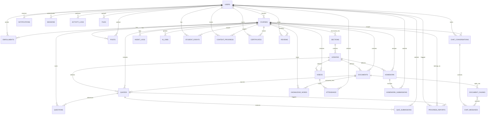

# CourseFlix — Project Plan & Database Schema (v2)

**Stack:** MongoDB (application data) + ChromaDB (vector embeddings) + Redis/BullMQ or Celery (AI job queue)
**Type Legend:** `ObjectId` = Mongo reference · `Embedded` = subdocument stored inline · `Enum[...]` = fixed value set · 🆕 = new in v2 · ✏️ = modified in v2

> This document merges the original CourseFlix architecture with the consolidated **Production Hardening & Enhancements** review. It is the single source of truth for user flows, schema, security posture, and indexing strategy.

---

## Table of Contents

1. [Goals & Scope](#1-goals--scope)
2. [User Flows](#2-user-flows)
3. [AI Assistant / Agent Flow](#3-ai-assistant--agent-flow-background-automation)
4. [Entity Relationship Diagram](#4-entity-relationship-diagram)
5. [Collections — Core](#5-collections--core)
6. [Collections — New in v2](#6-collections--new-in-v2)
7. [Importance of Each Collection](#7-importance-of-each-collection)
8. [AI & RAG Pipeline Enhancements](#8-ai--rag-pipeline-enhancements)
9. [Security & Production Hardening](#9-security--production-hardening)
10. [Feature Additions & Behavioural Updates](#10-feature-additions--behavioural-updates)
11. [Design Decisions](#11-design-decisions)
12. [Indexing Strategy](#12-indexing-strategy)
13. [Business Rules](#13-business-rules)
14. [Why This Structure Matters for the Defense](#14-why-this-structure-matters-for-the-defense)

---

## 1. Goals & Scope

CourseFlix is a Learning Management System supporting course management, student enrollment, an AI Tutor (RAG-based), a Content Scout agent, a Proactive Proctor agent, homework & quiz management, attendance tracking, notifications, and progress reports.

**v2 hardens the system along five axes:**

- **Structural organisation** — courses → sections → lessons, with every piece of content (video, quiz, homework, document) explicitly linked to the lesson/section that teaches it, instead of floating flat off the course.
- **Fine-grained progress & audit trails** — per-item progress, manual action logs, student event history.
- **Production-grade AI & RAG pipelines** — async job queue, versioned documents, moderation pipeline.
- **Security, anti-fraud & permissions** — soft deletes everywhere, attendance heartbeat, role arrays, manual-override protection.
- **Operational flexibility** — soft deletes, drip scheduling, enrolment caps, homework lifecycle states.

---

## 2. User Flows

### 2.1 Student Flow (User Story Style)

- **As a Student**, I register/login → redirected to **Student Dashboard** (role-based single login).
  → touches: `users`, `sessions`

- **As a Student**, I browse published courses and enroll (subject to `courses.max_students` cap).
  → touches: `courses`, `enrollments`

- **As a Student**, I navigate a course through its **sections and lessons**, some of which may be locked until a scheduled unlock date. Every video, quiz, homework, and document I encounter is attached to the lesson (and section) that teaches it, so the curriculum always renders in the right order.
  → touches: `sections`, `lessons`, `videos.lesson_id`, `quizzes.lesson_id`, `homework.lesson_id`, `documents.lesson_id`

- **As a Student**, I watch course videos → my watch time is tracked for attendance, guarded against multi-tab fraud via a heartbeat.
  → touches: `videos`, `attendance`

- **As a Student**, I ask the AI Tutor questions about the material → the AI answers using only my teacher's uploaded content (never generic internet knowledge), and every answer cites its grounding chunks with excerpts and scores.
  → touches: `chat_conversations`, `chat_messages`, `document_chunks` (via `source_chunks`)

- **As a Student**, if I struggle with a concept in chat, the **Proactive Proctor agent** silently notices and generates a mini-quiz for me to test my understanding.
  → touches: `agent_logs`, `quizzes` (`is_mini_quiz: true`), `questions`, `progress_reports`

- **As a Student**, I take assigned quizzes (manual or AI-generated), pulled from a reusable **question bank**, and see my score. My submission locks in the exact quiz version I took.
  → touches: `quizzes`, `questions`, `quiz_submissions`

- **As a Student**, I upload my homework → it gets graded (AI or teacher) → if my grade falls below the threshold, a **configurable progressive-discipline workflow** kicks in (warning → resources → mini-quiz → teacher notified → suspension) instead of an immediate suspension.
  → touches: `homework`, `homework_submissions`, `enrollments`, `student_events`

- **As a Student**, my per-item learning progress (video position, quiz/homework completion) is tracked individually so my overall course progress is always accurate and resumable.
  → touches: `content_progress`

- **As a Student**, I receive real-time notifications (new HW, quiz ready, announcements) via SSE, filtered by my own notification preferences and prioritised by urgency.
  → touches: `notifications`, `users.settings.notification_preferences`

- **As a Student**, once I complete a course I can download a **certificate** and leave a **review**.
  → touches: `certificates`, `reviews`

- **As a Student**, I customize my theme/account settings and notification preferences.
  → touches: `users.settings`

### 2.2 Teacher Flow (User Story Style)

- **As a Teacher**, I log in → redirected to **Teacher Dashboard**.
  → touches: `users`, `sessions`

- **As a Teacher**, I create/manage a course (CRUD), including structuring it into **sections and lessons**, with drip-scheduled unlock dates and an enrolment cap. As I add a video, quiz, homework, or document, I attach it directly to a lesson so it appears in the right place in the curriculum.
  → touches: `courses`, `sections`, `lessons`, `videos.lesson_id`, `quizzes.lesson_id`, `homework.lesson_id`, `documents.lesson_id`

- **As a Teacher**, I upload PDF/PPT lecture notes (centrally managed as `files`, deduplicated by checksum) → this triggers the **Content Scout agent** asynchronously via the AI job queue, which extracts concepts and builds a knowledge graph.
  → touches: `documents`, `files`, `document_chunks`, `knowledge_nodes`, `ai_jobs`, `agent_logs`

- **As a Teacher**, I re-upload a revised document → its `version` increments, old chunks are marked inactive (not deleted), and the knowledge graph updates to match.
  → touches: `documents`, `document_chunks`, `knowledge_nodes`

- **As a Teacher**, I create a quiz — either manually or by asking the AI to generate one from my uploaded documents — drawing from a shared **question bank**. Editing a published quiz increments its version without breaking historical submissions.
  → touches: `quizzes`, `questions`

- **As a Teacher**, I assign homework with a grading threshold and manage its lifecycle (Draft → Published → Open → Closed → Archived).
  → touches: `homework`

- **As a Teacher**, I post announcements/updates to my course feed.
  → touches: `posts`

- **As a Teacher**, I go live for a session → students' watch time is tracked automatically, with fraud protection via device-locked heartbeats.
  → touches: `videos` (`type: live`), `attendance`

- **As a Teacher**, I passively receive **progress reports** by email when the Proactive Proctor flags a struggling student — without manually reading every chat log.
  → touches: `progress_reports`, `agent_logs`

- **As a Teacher**, my manual grading/override decisions on a suspended student are protected — background auto-suspension agents cannot silently reverse them.
  → touches: `enrollments.override_active`, `enrollments.status_changed_by`

- **As a Teacher/Admin**, every manual action I take is recorded for accountability, and I can view analytics on my course (completion rate, attendance, AI usage, token cost).
  → touches: `activity_logs`, analytics layer (§10.7)

### 2.3 Admin Flow

- **As an Admin**, I hold an array of `permissions` (e.g. `["admin", "teaching_assistant"]`) rather than a single fixed role, so new capabilities can be granted without a schema migration.
  → touches: `users.permissions`

---

## 3. AI Assistant / Agent Flow (Background Automation)

1. **Document Ingestion:** Teacher uploads a file → stored once in `files` (deduplicated via `checksum`) → `documents` record created → an `ai_jobs` entry is queued (Redis/BullMQ or Celery) → chunked → embedded into ChromaDB → `document_chunks` created → **Content Scout** builds `knowledge_nodes`.
2. **Tutoring:** Student sends a message → Tutor LLM retrieves relevant `document_chunks` → generates a grounded response → logged in `chat_messages` with `source_chunks` (chunk_id, relevance_score, excerpt, vector_id) for traceability, plus `model_name`/`provider`/`temperature`/`prompt_version` for version tracking.
3. **Moderation:** Any flagged `chat_messages` moves through `moderation_status`: `pending` → manual review → `approved` / `blocked`, preventing prompt-injection content from reaching the LLM.
4. **Proctoring:** **Proactive Proctor** continuously scans `chat_messages` → on detecting struggle, creates a mini `quizzes` entry (sourced from `questions`) + `progress_reports` entry → emails teacher.
5. **Grading Automation:** `homework_submissions` graded → Assistant compares against `homework.pass_threshold` → triggers the **progressive discipline workflow**: warning → resources → mini-quiz → teacher notified → (only after repeated failures) `enrollments.status = suspended`, unless `override_active` is set by a teacher.
6. **Attendance Automation:** Video watch events, gated by heartbeat + `device_session_id`, atomically `$inc` `attendance.watched_seconds` and recompute `is_present` against `videos.min_attendance_percentage`.
7. **Vector Lifecycle:** When `documents.deleted_at` is set, a background worker purges the corresponding vectors from ChromaDB using `document_chunks.vector_id`. Re-uploads bump `documents.version` and mark old chunks `is_active: false` rather than deleting history.

---

## 4. Entity Relationship Diagram



---

## 5. Collections — Core

### `users`

| Field | Type | Required | Notes |
|---|---|---|---|
| `_id` | ObjectId | ✔ | PK |
| `full_name` | String | ✔ | |
| `email` | String | ✔ | Unique, indexed |
| `password_hash` | String | ✔ | |
| `role` | Enum[student, teacher] | ✔ | Drives single-login redirect |
| `avatar_url` | String | | |
| `settings` | Embedded {theme, language, email_notifications, `notification_preferences` 🆕} | | 1:1, small → embedded |
| `permissions` 🆕 | Array\<String\> | | e.g. `["admin", "teaching_assistant"]` — future-proof role expansion without migration |
| `status` | Enum[active, suspended, inactive] | ✔ | Default `active` |
| `last_login_at` | Date | | |
| `deleted_at` 🆕 | Date | | Soft delete |
| `created_at` / `updated_at` | Date | ✔ | |

> **`settings.notification_preferences`** 🆕: object of booleans per notification type (e.g. `hw_assigned: true`, `quiz_ready: false`) — read by delivery logic before sending.

### `courses`

| Field | Type | Required | Notes |
|---|---|---|---|
| `_id` | ObjectId | ✔ | |
| `teacher_id` | ObjectId → users | ✔ | Indexed |
| `title` | String | ✔ | |
| `description` | String | | |
| `thumbnail_url` | String | | |
| `category` | String | | |
| `status` | Enum[draft, published, archived] | ✔ | |
| `max_students` 🆕 | Number | | Enforced atomically via transaction on enrollment |
| `deleted_at` 🆕 | Date | | Soft delete |
| `created_at` / `updated_at` | Date | ✔ | |

### `enrollments`

| Field | Type | Required | Notes |
|---|---|---|---|
| `_id` | ObjectId | ✔ | |
| `student_id` | ObjectId → users | ✔ | Indexed |
| `course_id` | ObjectId → courses | ✔ | Indexed |
| `status` | Enum[active, suspended, completed] | ✔ | Default `active` |
| `suspended_reason` | String | | Auto-filled by Assistant agent |
| `suspended_at` | Date | | |
| `suspended_by_submission_id` 🆕 | ObjectId → homework_submissions | | Links suspension to the exact failing submission for appeals |
| `status_changed_by` 🆕 | Enum[system_agent, teacher] | | Prevents auto-suspension from overriding a teacher decision |
| `override_active` 🆕 | Boolean | | If true, background workers cannot auto-suspend |
| `progress_percentage` | Number | | *Legacy — being superseded by `content_progress` aggregation; retained for backward compatibility or removed* |
| `enrolled_at` | Date | ✔ | |
| `deleted_at` 🆕 | Date | | Soft delete |

> [!note] Unique compound index on `(student_id, course_id)` to prevent duplicate enrollment.

### `documents`

| Field | Type | Required | Notes |
|---|---|---|---|
| `_id` | ObjectId | ✔ | |
| `course_id` | ObjectId → courses | ✔ | Indexed |
| `section_id` 🆕 | ObjectId → sections | | Where this document lives in the curriculum |
| `lesson_id` 🆕 | ObjectId → lessons | | Optional finer-grained placement within the section |
| `uploaded_by` | ObjectId → users | ✔ | |
| `file_id` 🆕 | ObjectId → files | | Replaces raw `file_url`; centralised asset management |
| `file_name` | String | ✔ | |
| `file_type` | Enum[pdf, pptx] | ✔ | |
| `processing_status` | Enum[pending, processing, completed, failed] | ✔ | RAG ingestion state |
| `vector_namespace` | String | | ChromaDB collection ref |
| `checksum` 🆕 | String | | SHA256 — prevents redundant embedding of identical files |
| `version` 🆕 | Number | | Incremented on re-upload; invalidates old chunks |
| `deleted_at` 🆕 | Date | | Soft delete; triggers background ChromaDB vector purge |
| `created_at` | Date | ✔ | |

### `document_chunks`

| Field | Type | Required | Notes |
|---|---|---|---|
| `_id` | ObjectId | ✔ | |
| `document_id` | ObjectId → documents | ✔ | Indexed |
| `chunk_index` | Number | ✔ | |
| `text_preview` | String | | Full text lives in ChromaDB payload |
| `vector_id` | String | ✔ | Bridges Mongo ↔ ChromaDB |
| `page_number` | Number | | |
| `token_count` | Number | | |
| `is_active` 🆕 | Boolean | | Default true — marks old chunks inactive without losing history |
| `deleted_at` 🆕 | Date | | Soft delete |

### `knowledge_nodes`

| Field | Type | Required | Notes |
|---|---|---|---|
| `_id` | ObjectId | ✔ | |
| `course_id` | ObjectId → courses | ✔ | Indexed |
| `document_id` | ObjectId → documents | ✔ | |
| `concept` | String | ✔ | Content Scout output |
| `related_node_ids` | Array\<ObjectId\> | | Denormalized graph edges |
| `importance_score` | Number | | |
| `version` 🆕 | Number | | Keeps graph aligned with document version |
| `deleted_at` 🆕 | Date | | Soft delete |

### `videos`

| Field | Type | Required | Notes |
|---|---|---|---|
| `_id` | ObjectId | ✔ | |
| `course_id` | ObjectId → courses | ✔ | Indexed |
| `section_id` 🆕 | ObjectId → sections | | Where this video lives in the curriculum |
| `lesson_id` 🆕 | ObjectId → lessons | | Optional finer-grained placement within the section |
| `title` | String | ✔ | |
| `video_url` | String | ✔ | |
| `type` | Enum[recorded, live] | ✔ | |
| `duration_seconds` | Number | | |
| `status` | Enum[scheduled, live, ended, recorded] | ✔ | |
| `scheduled_at` | Date | | |
| `min_attendance_percentage` 🆕 | Number | | Configurable per-video threshold (default 80%) |
| `deleted_at` 🆕 | Date | | Soft delete |

### `attendance`

| Field | Type | Required | Notes |
|---|---|---|---|
| `_id` | ObjectId | ✔ | |
| `student_id` | ObjectId → users | ✔ | Indexed |
| `video_id` | ObjectId → videos | ✔ | Indexed |
| `watched_seconds` | Number | ✔ | Default 0; updated via atomic `$inc` |
| `watched_percentage` | Number | ✔ | Default 0 |
| `is_present` | Boolean | ✔ | Derived: `watched_percentage ≥ videos.min_attendance_percentage` |
| `last_heartbeat_at` 🆕 | Date | | Active client ping every 30s — live-stream fraud prevention |
| `device_session_id` 🆕 | String | | Locks attendance to a single browser instance |
| `last_updated_at` | Date | ✔ | |

> [!note] Unique compound index on `(student_id, video_id)`.

### `posts`

| Field | Type | Required | Notes |
|---|---|---|---|
| `_id` | ObjectId | ✔ | |
| `course_id` | ObjectId → courses | ✔ | |
| `teacher_id` | ObjectId → users | ✔ | |
| `content` | String | ✔ | |
| `attachments` | Array\<String\> | | |
| `deleted_at` 🆕 | Date | | Soft delete |
| `created_at` / `updated_at` | Date | ✔ | |

### `quizzes`

| Field | Type | Required | Notes |
|---|---|---|---|
| `_id` | ObjectId | ✔ | |
| `course_id` | ObjectId → courses | ✔ | Indexed |
| `section_id` 🆕 | ObjectId → sections | | Where this quiz lives in the curriculum (omit for a Proactive Proctor mini-quiz) |
| `lesson_id` 🆕 | ObjectId → lessons | | Optional finer-grained placement within the section |
| `source_document_id` | ObjectId → documents | | Null if manual |
| `created_by` | ObjectId → users | | Null if AI-generated |
| `generation_type` | Enum[manual, rag_generated] | ✔ | |
| `is_mini_quiz` | Boolean | ✔ | Default false; true = Proactive Proctor auto-quiz |
| `title` | String | ✔ | |
| `question_ids` ✏️ | Array\<ObjectId\> → questions | ✔ | **Replaces** embedded `questions` array — enables question-bank reuse |
| `version` 🆕 | Number | | Increments on teacher revision; preserved in submissions |
| `deleted_at` 🆕 | Date | | Soft delete |

### `quiz_submissions`

| Field | Type | Required | Notes |
|---|---|---|---|
| `_id` | ObjectId | ✔ | |
| `quiz_id` | ObjectId → quizzes | ✔ | Indexed |
| `student_id` | ObjectId → users | ✔ | Indexed |
| `answers` | Embedded Array [{ `question_id`, `selected_answer`, `is_correct` }] | ✔ | |
| `score` | Number | ✔ | |
| `quiz_version` 🆕 | Number | | Locks the exact quiz version taken, preventing structural mismatch |
| `deleted_at` 🆕 | Date | | Soft delete |
| `submitted_at` | Date | ✔ | |

### `homework`

| Field | Type | Required | Notes |
|---|---|---|---|
| `_id` | ObjectId | ✔ | |
| `course_id` | ObjectId → courses | ✔ | |
| `section_id` 🆕 | ObjectId → sections | | Where this homework lives in the curriculum |
| `lesson_id` 🆕 | ObjectId → lessons | | Optional finer-grained placement within the section |
| `teacher_id` | ObjectId → users | ✔ | |
| `title` | String | ✔ | |
| `description` | String | | |
| `due_date` | Date | ✔ | |
| `max_grade` | Number | ✔ | |
| `pass_threshold` | Number | ✔ | Used by progressive-discipline workflow |
| `lifecycle_status` 🆕 | Enum[draft, published, open, closed, archived] | ✔ | Enables scheduled releases and teacher workflows |
| `deleted_at` 🆕 | Date | | Soft delete |

### `homework_submissions`

| Field | Type | Required | Notes |
|---|---|---|---|
| `_id` | ObjectId | ✔ | |
| `homework_id` | ObjectId → homework | ✔ | Indexed |
| `student_id` | ObjectId → users | ✔ | Indexed |
| `file_url` | String | ✔ | |
| `grade` | Number | | |
| `feedback` | String | | |
| `graded_by` | Enum[ai_assistant, teacher] | | |
| `status` | Enum[submitted, graded, late] | ✔ | Default `submitted` |
| `submitted_at` | Date | ✔ | |
| `graded_at` | Date | | |
| `deleted_at` 🆕 | Date | | Soft delete |

> [!note] Unique compound index on `(homework_id, student_id)`.

### `chat_conversations`

| Field | Type | Required | Notes |
|---|---|---|---|
| `_id` | ObjectId | ✔ | |
| `student_id` | ObjectId → users | ✔ | Indexed |
| `course_id` | ObjectId → courses | ✔ | Indexed |
| `status` | Enum[active, closed] | ✔ | Default `active` |
| `deleted_at` 🆕 | Date | | Soft delete |
| `started_at` / `last_message_at` | Date | ✔ | |

### `chat_messages`

| Field | Type | Required | Notes |
|---|---|---|---|
| `_id` | ObjectId | ✔ | |
| `conversation_id` | ObjectId → chat_conversations | ✔ | Indexed |
| `sender_type` | Enum[student, ai_tutor] | ✔ | |
| `role` 🆕 | Enum[user, assistant, system] | ✔ | Standard LLM message mapping |
| `message_text` | String | ✔ | |
| `source_chunks` ✏️ | Array\<{ chunk_id, relevance_score, excerpt, vector_id }\> | | Grounding evidence with excerpts and scores (upgraded from plain ObjectId array) |
| `summary_state` 🆕 | String | | Compressed memory snapshot for context-window control |
| `moderation_status` 🆕 | Enum[pending, approved, blocked] | | Lifecycle for flagged message moderation |
| `model_name` / `provider` / `temperature` / `prompt_version` 🆕 | String / String / Number / String | | AI version tracking per response |
| `tokens_used` | Number | | Cost tracking |
| `flagged` | Boolean | | Default false — moderation flag |
| `flag_reason` | String | | |
| `deleted_at` 🆕 | Date | | Soft delete |
| `created_at` | Date | ✔ | |

### `progress_reports`

| Field | Type | Required | Notes |
|---|---|---|---|
| `_id` | ObjectId | ✔ | |
| `student_id` | ObjectId → users | ✔ | Indexed |
| `course_id` | ObjectId → courses | ✔ | |
| `teacher_id` | ObjectId → users | ✔ | |
| `flagged_concept` | String | ✔ | Proactive Proctor output |
| `related_quiz_id` | ObjectId → quizzes | | Auto-generated mini-quiz |
| `teacher_notified` | Boolean | ✔ | Default false |
| `email_sent_at` | Date | | |
| `deleted_at` 🆕 | Date | | Soft delete |

### `notifications`

| Field | Type | Required | Notes |
|---|---|---|---|
| `_id` | ObjectId | ✔ | |
| `user_id` | ObjectId → users | ✔ | Indexed |
| `type` | Enum[hw_assigned, quiz_ready, progress_report, announcement, course_update, system] | ✔ | |
| `title` / `message` | String | ✔ | |
| `related_entity_type` | String | | |
| `related_entity_id` | ObjectId | | |
| `priority` 🆕 | Enum[low, normal, high, critical] | ✔ | Categorises urgency |
| `delivery_status` 🆕 | String | | Enhanced delivery tracking |
| `scheduled_at` 🆕 | Date | | Deferred send support |
| `read_at` 🆕 | Date | | |
| `is_read` | Boolean | ✔ | Default false |
| `deleted_at` 🆕 | Date | | Soft delete |
| `created_at` | Date | ✔ | Delivered via SSE |

### `agent_logs`

| Field | Type | Required | Notes |
|---|---|---|---|
| `_id` | ObjectId | ✔ | |
| `agent_type` | Enum[content_scout, proactive_proctor, tutor_llm] | ✔ | |
| `course_id` | ObjectId → courses | | |
| `target_entity_type` / `target_entity_id` | String / ObjectId | | |
| `action` | String | ✔ | |
| `status` | Enum[success, failed, retrying] | ✔ | |
| `tokens_used` | Number | | |
| `error_message` | String | | |
| `executed_at` | Date | ✔ | |

### `sessions`

| Field | Type | Required | Notes |
|---|---|---|---|
| `_id` | ObjectId | ✔ | |
| `user_id` | ObjectId → users | ✔ | Indexed |
| `refresh_token_hash` | String | ✔ | |
| `device_info` / `ip_address` ✏️ | String | ✔ | Now always populated for anomaly detection |
| `expires_at` | Date | ✔ | |
| `created_at` | Date | ✔ | |

---

## 6. Collections — New in v2

### `sections` (a.k.a. `modules`) 🆕

| Field | Type | Required | Notes |
|---|---|---|---|
| `_id` | ObjectId | ✔ | |
| `course_id` | ObjectId → courses | ✔ | Indexed |
| `title` | String | ✔ | |
| `order_index` | Number | ✔ | |
| `unlock_at` | Date | | Drip-content scheduling |
| `status` | Enum[draft, published] | ✔ | |
| `deleted_at` | Date | | Soft delete |

### `lessons` 🆕

| Field | Type | Required | Notes |
|---|---|---|---|
| `_id` | ObjectId | ✔ | |
| `section_id` | ObjectId → sections | ✔ | Indexed |
| `course_id` 🆕 | ObjectId → courses | ✔ | Denormalized for fast course-wide lesson queries |
| `title` | String | ✔ | |
| `description` | String | | |
| `order_index` | Number | ✔ | |
| `estimated_duration` | Number | | Minutes |
| `unlock_at` 🆕 | Date | | Optional lesson-level override of the section's `unlock_at` |
| `status` | Enum[draft, published] | ✔ | |
| `deleted_at` 🆕 | Date | | Soft delete |

> **How content attaches to the curriculum:** there is no separate join collection. Each content-bearing document (`videos`, `quizzes`, `homework`, `documents`) carries its own `section_id` (required once published) and an optional `lesson_id` for finer placement. To render a section/lesson page, the backend queries each content collection by `lesson_id` (or `section_id` when a video/quiz/homework/document isn't broken into a specific lesson) and merges the results, ordered by each content item's own `order_index` field (add `order_index` to each of those collections if strict interleaved ordering across types is required).

### `questions` 🆕

| Field | Type | Required | Notes |
|---|---|---|---|
| `_id` | ObjectId | ✔ | |
| `course_id` | ObjectId → courses | ✔ | Indexed |
| `type` | Enum[mcq, true_false, short_answer] | ✔ | |
| `text` | String | ✔ | |
| `options` | Array\<String\> | | For `mcq` |
| `correct_answer` | String | ✔ | |
| `tags` | Array\<String\> | | Enables filtering into pools |
| `difficulty` | String | | |
| `deleted_at` | Date | | Soft delete |

> Referenced by `quizzes.question_ids`. Enables question pools, per-question analytics, and cross-quiz reuse.

### `files` 🆕

| Field | Type | Required | Notes |
|---|---|---|---|
| `_id` | ObjectId | ✔ | |
| `file_name` | String | ✔ | |
| `mime_type` | String | ✔ | |
| `size` | Number | ✔ | |
| `storage_provider` | String | ✔ | e.g. `s3`, `gcs` |
| `storage_path` | String | ✔ | |
| `checksum` | String | ✔ | Enables deduplication |
| `uploaded_by` | ObjectId → users | ✔ | |
| `created_at` | Date | ✔ | |

> All other collections reference `file_id` instead of raw URLs — single upload system, easier migrations, deduplication, versioning support.

### `content_progress` (a.k.a. `lesson_progress`) 🆕

| Field | Type | Required | Notes |
|---|---|---|---|
| `_id` | ObjectId | ✔ | |
| `student_id` | ObjectId → users | ✔ | Indexed |
| `course_id` | ObjectId → courses | ✔ | Indexed |
| `item_type` | String | ✔ | e.g. `video`, `quiz`, `homework`, `lesson` |
| `item_id` | ObjectId | ✔ | |
| `status` | Enum[not_started, in_progress, completed] | ✔ | |
| `progress_percentage` | Number | | |
| `last_video_position` | Number | | Seconds — enables resume |
| `completed_at` | Date | | |
| `score` | Number | | |

> Single source of truth for learner activity; `enrollments.progress_percentage` is derived from this via aggregation (or removed entirely).

### `ai_jobs` 🆕

| Field | Type | Required | Notes |
|---|---|---|---|
| `_id` | ObjectId | ✔ | |
| `job_type` | String | ✔ | e.g. `chunk`, `embed`, `generate_quiz` |
| `status` | Enum[queued, processing, completed, failed] | ✔ | |
| `priority` | Number | | |
| `retries` | Number | | |
| `target_entity` | ObjectId | ✔ | |
| `started_at` / `finished_at` | Date | | |
| `error_message` | String | | |

> Backed by Redis/BullMQ or Celery. Keeps chunking, embedding, and quiz-generation off HTTP threads.

### `activity_logs` 🆕 — manual action audit (teacher/admin)

| Field | Type | Required | Notes |
|---|---|---|---|
| `_id` | ObjectId | ✔ | |
| `user_id` | ObjectId → users | ✔ | |
| `action` | String | ✔ | |
| `entity_type` / `entity_id` | String / ObjectId | ✔ | |
| `timestamp` | Date | ✔ | |
| `metadata` | Object | | |

### `student_events` 🆕 — student event history

| Field | Type | Required | Notes |
|---|---|---|---|
| `_id` | ObjectId | ✔ | |
| `student_id` | ObjectId → users | ✔ | Indexed |
| `course_id` | ObjectId → courses | ✔ | |
| `event_type` | Enum[enrolled, homework_failed, warning_issued, suspended, restored, ...] | ✔ | |
| `reason` | String | | |
| `metadata` | Object | | |
| `created_at` | Date | ✔ | |

> Together, `activity_logs` and `student_events` complement the existing `agent_logs` for complete traceability across human, agent, and student actions.

### `certificates` 🆕

| Field | Type | Required | Notes |
|---|---|---|---|
| `_id` | ObjectId | ✔ | |
| `student_id` | ObjectId → users | ✔ | |
| `course_id` | ObjectId → courses | ✔ | |
| `certificate_number` | String | ✔ | |
| `issued_at` | Date | ✔ | |
| `pdf_url` | String | | |

### `reviews` 🆕

| Field | Type | Required | Notes |
|---|---|---|---|
| `_id` | ObjectId | ✔ | |
| `student_id` | ObjectId → users | ✔ | |
| `course_id` | ObjectId → courses | ✔ | |
| `rating` | Number (1–5) | ✔ | |
| `comment` | String | | |
| `created_at` | Date | ✔ | |
| `deleted_at` | Date | | Soft delete |

---

## 7. Importance of Each Collection

| Collection | Why It Exists / Core Importance |
|---|---|
| `users` | Single source of identity for both roles; drives the one-login-page redirect logic; `permissions` array future-proofs role growth. |
| `courses` | The central entity everything else scopes to — sections, documents, videos, quizzes, HW all belong to a course; `max_students` enforces capacity. |
| `sections` / `lessons` 🆕 | Turns a flat content list into a real curriculum. `videos`, `quizzes`, `homework`, and `documents` each carry their own `section_id`/`lesson_id`, so ordering, drip scheduling, and per-module progress aggregation come from a direct link, not a separate join table. |
| `enrollments` | Tracks the student↔course relationship and its *state* — now protected from being silently overwritten by background agents via `override_active`. |
| `questions` 🆕 | Decouples question content from any one quiz — enables pools, reuse, and per-question analytics instead of duplicated embedded arrays. |
| `files` 🆕 | Centralises binary asset handling — one upload path, checksum dedup, and versioning instead of scattered raw URLs. |
| `documents` | Source-of-truth files that feed the entire RAG pipeline; `checksum`/`version` prevent redundant embedding and support safe re-uploads. |
| `document_chunks` | Bridges MongoDB and ChromaDB — keeps heavy vectors out of Mongo while tracing *which* chunk answered *which* question (hallucination defense); `is_active` supports versioning without data loss. |
| `knowledge_nodes` | Powers the "Knowledge Graph" feature from the Content Scout agent; versioned to stay aligned with its source document. |
| `videos` | Represents both recorded and live content — the actual teaching medium students consume; per-video attendance threshold. |
| `attendance` | Directly required by spec ("Attendance based on video time"); heartbeat + device lock defend against multi-tab watch-time fraud. |
| `content_progress` 🆕 | Single source of truth for learner activity across all item types — replaces a vague percentage field with an auditable, resumable trail. |
| `posts` | Lightweight course announcements — keeps teacher communication separate from structured data like HW/quizzes. |
| `quizzes` | Supports *both* manual and AI-generated quizzes, distinguishes mini-quizzes, and is now versioned so historical grades survive future edits. |
| `quiz_submissions` | Independent from `quizzes` because submissions grow unboundedly; `quiz_version` locks grading to the exact quiz the student took. |
| `homework` | Defines the assignment + grading threshold that feeds the progressive-discipline workflow; lifecycle states enable scheduled releases. |
| `homework_submissions` | Where the discipline workflow actually fires from — grade comparison happens here. |
| `chat_conversations` | Groups messages into sessions per student per course — needed for context windows and conversation history. |
| `chat_messages` | The most sensitive table: `source_chunks` (grounding), `tokens_used` (cost), `moderation_status` (injection defense), and AI version fields (debugging/cost analysis). |
| `progress_reports` | The output of the Proactive Proctor — the "autonomous action" that differentiates CourseFlix from a simple LMS. |
| `notifications` | Powers the SSE feature; `priority` and per-user `notification_preferences` make delivery configurable rather than all-or-nothing. |
| `agent_logs` | Observability layer for *all* AI agents — essential for debugging cost overruns, failed generations, and agent reliability. |
| `ai_jobs` 🆕 | Decouples heavy AI work from HTTP request threads — the backbone of a production-grade async pipeline. |
| `activity_logs` 🆕 | Accountability trail for every manual teacher/admin action — complements agent-driven `agent_logs`. |
| `student_events` 🆕 | Full lifecycle history per student (enrolled, warned, suspended, restored) — supports appeals and transparency. |
| `certificates` / `reviews` 🆕 | Adds LMS professionalism — completion credentials and social proof. |
| `sessions` | Enables secure, revocable authentication (refresh tokens) rather than relying on stateless JWTs alone. |

---

## 8. AI & RAG Pipeline Enhancements

### 8.1 AI Service Separation

Isolate AI responsibilities (Tutor, Quiz Generator, Homework Grader, Content Scout, Embedding, Proctor) from LMS business logic. Benefits: independent deployment, easier model swap, cleaner architecture.

### 8.2 RAG Vector Sync & Deduplication

- **Soft-delete hooks:** when `documents.deleted_at` is set, a background worker purges corresponding vectors from ChromaDB using `document_chunks.vector_id`.
- **Checksum dedup:** identical files (via `files.checksum`) are re-chunked only once, saving embedding costs.

### 8.3 Chat Memory & Cost Control

- `chat_messages.role` maps directly to LLM provider expectations.
- When a conversation grows long, an LLM summariser compresses older turns into `summary_state` on the latest message, slashing token overhead.

### 8.4 AI Version Tracking

Each AI-generated message logs `model_name`, `provider`, `temperature`, and `prompt_version` — enables cost analysis, prompt comparison, and easier debugging.

### 8.5 Moderation Pipeline

Flagged chat messages progress through `moderation_status`: `pending` → manual review → `approved` / `blocked` — prevents injection attempts from reaching the LLM.

---

## 9. Security & Production Hardening

### 9.1 Full Soft-Delete Strategy

Every major collection now includes `deleted_at` (nullable Date). All read queries filter out soft-deleted records — enables recovery, safer operations, and complete audit trails.

### 9.2 Anti-Fraud for Live Attendance

- Frontend sends a cryptographic heartbeat every 30 seconds.
- Backend tracks `device_session_id` and `last_heartbeat_at`.
- Duplicate student check-ins from different devices lock out existing streams, preventing multi-tab watch-time fraud.

### 9.3 Quiz Version Isolation

Quizzes increment `version` on teacher edit. `quiz_submissions` store `quiz_version`, decoupling historical grades from future structural changes.

### 9.4 Manual Override Protection

`enrollments.override_active` and `status_changed_by` prevent background auto-suspension agents from overwriting a teacher's manual grading decision.

### 9.5 Suspension Transparency

`suspended_by_submission_id` directly links a suspension to the exact homework submission that triggered it; `suspended_reason` can be auto-generated.

### 9.6 Role-Based Permissions (Future)

`users.permissions` array (e.g. `["admin", "teaching_assistant"]`) replaces reliance on a single `role` field. Middleware checks these for sensitive routes.

### 9.7 Enrolment Caps & Transactions

`courses.max_students` is enforced atomically: before inserting an enrolment, the system counts active enrolments and validates the cap within a MongoDB transaction.

### 9.8 Atomic Attendance Updates

`watched_seconds` incremented via `$inc` and `is_present` set in a single atomic operation, preventing race conditions.

### 9.9 Session Anomaly Detection

`sessions` record `device_info` and `ip_address`; future layers can flag unusual login patterns.

---

## 10. Feature Additions & Behavioural Updates

### 10.1 Drip Content Scheduling

`sections.unlock_at` allows teachers to set future unlock dates. Students see "locked" sections until the time arrives; backend enforces access control.

### 10.2 Configurable Academic Policies (Progressive Discipline)

Replaces the rigid "fail → suspend" rule with a configurable workflow:

1. Homework failed → Warning issued
2. Recommended learning resources provided
3. Mini-quiz generated
4. Teacher notified
5. Repeated failures → temporary suspension

### 10.3 Homework Lifecycle States

`Draft → Published → Open → Closed → Archived` — enables scheduled releases and better teacher workflows.

### 10.4 Document Versioning & Re-upload

On re-upload, `documents.version` increments. Existing chunks are marked `is_active: false`; new chunks reference the new version. Knowledge graph nodes follow the same versioning.

### 10.5 Granular Notification Preferences

`users.settings.notification_preferences` controls per-type opt-ins (e.g. `hw_assigned: true`, `quiz_ready: false`). Notification delivery logic reads these flags before sending.

### 10.6 Per-Video Attendance Threshold

`videos.min_attendance_percentage` (default 80%) determines `attendance.is_present`, making the rule configurable per video/course.

### 10.7 Analytics Layer (Foundation)

Dashboards for teachers/admins: total students, active students, completion rate, homework/quiz averages, attendance, AI usage, token consumption. Metrics can be computed on-demand or materialised periodically.

---

## 11. Design Decisions

> [!note] Embed vs Reference
>
> - `quizzes.question_ids` ✏️ → **referenced**, not embedded (was embedded in v1) — a quiz now points into the shared `questions` bank instead of owning a private copy.
> - `quiz_submissions`, `homework_submissions`, `chat_messages`, `attendance`, `content_progress` 🆕 → **separate collections** (unbounded growth, queried independently).
> - `users.settings` → **embedded** (1:1, small, no independent queries); `notification_preferences` nests inside it for the same reason.
> - `videos.lesson_id` / `quizzes.lesson_id` / `homework.lesson_id` / `documents.lesson_id` → direct reference, not a polymorphic join table. Each content collection already carries `course_id`/`section_id`; adding `lesson_id` lets it also nest under a specific lesson without a `section_items`-style intermediary, keeping curriculum rendering to one query per content type.

> [!warning] Risk-Driven Schema Choices
>
> - **Prompt Injection** → `chat_messages.flagged` / `flag_reason` / `moderation_status` enable a full moderation pipeline before content reaches the LLM.
> - **Token Quota & Cost** → `tokens_used` tracked on both `chat_messages` and `agent_logs`, plus `ai_jobs` for async cost accounting, for per-course/day cost aggregation.
> - **Retrieval Hallucination** → `chat_messages.source_chunks` (now with excerpt + relevance score) forces every AI answer to cite grounding chunks; empty array = flag for review.
> - **ChromaDB Performance** → `document_chunks.vector_id` keeps Mongo lightweight (metadata only), heavy vector ops stay in ChromaDB; `checksum` dedup avoids redundant embedding.
> - **Data Loss / Compliance** → universal `deleted_at` soft delete across all major collections enables recovery and audit instead of destructive deletes.
> - **Grading Fairness** → `quizzes.version` / `quiz_submissions.quiz_version` and `documents.version` / `document_chunks.is_active` decouple historical records from later edits.

---

## 12. Indexing Strategy

| Collection | Index | Purpose |
|---|---|---|
| `users` | `email` (unique) | Login lookup |
| `enrollments` | `(student_id, course_id)` unique | Prevent duplicate enrollment |
| `attendance` | `(student_id, video_id)` unique | Prevent duplicate tracking rows |
| `homework_submissions` | `(homework_id, student_id)` unique | One submission per student |
| `documents` | `course_id` | Filter by course |
| `quiz_submissions` | `(quiz_id, student_id)` | Fast grade lookup |
| `notifications` | `(user_id, is_read)` | Unread inbox queries |
| `chat_messages` | `(conversation_id, created_at)` ✏️ | Chronological chat history rendering |
| `attendance` 🆕 | `(video_id, student_id)` | High-speed stream attendee verification |
| `agent_logs` 🆕 | `(course_id, executed_at desc)` | Course audit trend reporting |
| `sections` 🆕 | `(course_id, order_index)` | Ordered curriculum rendering |
| `lessons` 🆕 | `(section_id, order_index)` | Ordered lesson rendering within a section |
| `videos` 🆕 | `lesson_id` | Fetch a lesson's video(s) |
| `quizzes` 🆕 | `lesson_id` | Fetch a lesson's quiz(zes) |
| `homework` 🆕 | `lesson_id` | Fetch a lesson's homework |
| `documents` 🆕 | `lesson_id` | Fetch a lesson's document(s) |
| `questions` 🆕 | `course_id` | Question bank filtering |
| `content_progress` 🆕 | `(student_id, course_id)` | Aggregate a student's overall progress |
| `student_events` 🆕 | `(student_id, course_id, created_at)` | Timeline / appeal review |
| `files` 🆕 | `checksum` | Deduplication lookup |

```javascript
// Chronological chat history rendering
db.chat_messages.createIndex({ conversation_id: 1, created_at: 1 });

// High-speed stream attendee verification
db.attendance.createIndex({ video_id: 1, student_id: 1 });

// Course audit trend reporting
db.agent_logs.createIndex({ course_id: 1, executed_at: -1 });
```

---

## 13. Business Rules

- **Suspension (Progressive Discipline):** Assistant agent compares `homework_submissions.grade` to `homework.pass_threshold` → on failure, walks the configurable workflow (warning → resources → mini-quiz → teacher notified → suspension) instead of suspending immediately; each step logged to `student_events`. Final suspension sets `enrollments.status = suspended`, `suspended_reason`, and `suspended_by_submission_id`, unless `enrollments.override_active` is set by a teacher.
- **Attendance:** `attendance.is_present` recomputed when `watched_percentage` crosses `videos.min_attendance_percentage`, gated by a valid `last_heartbeat_at` and matching `device_session_id`.
- **Auto Mini-Quiz:** Proactive Proctor creates a `quizzes` doc (`is_mini_quiz = true`, sourced from `questions`) + `progress_reports` entry when struggle is detected in `chat_messages`.
- **RAG Grounding:** Every `ai_tutor` message must resolve `source_chunks` from the course's own active (`is_active: true`) `documents` — never external knowledge.
- **Document Re-upload:** On re-upload, `documents.version` increments; prior `document_chunks` are marked `is_active: false` (not deleted); ChromaDB vectors for soft-deleted documents are purged asynchronously.
- **Quiz Edits:** Editing a published quiz increments `quizzes.version`; existing `quiz_submissions` retain their original `quiz_version` and are graded against that snapshot.
- **Enrolment Cap:** Before inserting an `enrollments` record, the system counts active enrolments for the course inside a transaction and rejects if `≥ courses.max_students`.
- **Soft Delete:** All reads filter `deleted_at: null`; nothing is hard-deleted except via an explicit, audited admin purge.

---

## 14. Why This Structure Matters for the Defense

- Every **risk factor** (prompt injection, cost, hallucination, ChromaDB performance, data loss, grading fairness) maps to a **specific field**, not just a vague mitigation — defensible in front of judges.
- Every **agent-driven feature** (Content Scout, Proactive Proctor) has its own **audit trail** (`agent_logs`, `progress_reports`, and now `ai_jobs`, `activity_logs`, `student_events`) — proving the "autonomous action" claim isn't just marketing.
- Separating **submissions from definitions** (`quiz` vs `quiz_submissions`, `homework` vs `homework_submissions`) and now **questions from quizzes** avoids unbounded array growth and enables reuse — a common signal of schema maturity.
- The v2 additions (soft deletes, versioning, job queue, progressive discipline, drip content) move CourseFlix from a working prototype to an **operationally resilient, production-hardened** LMS without discarding any of the original architecture's reasoning.
